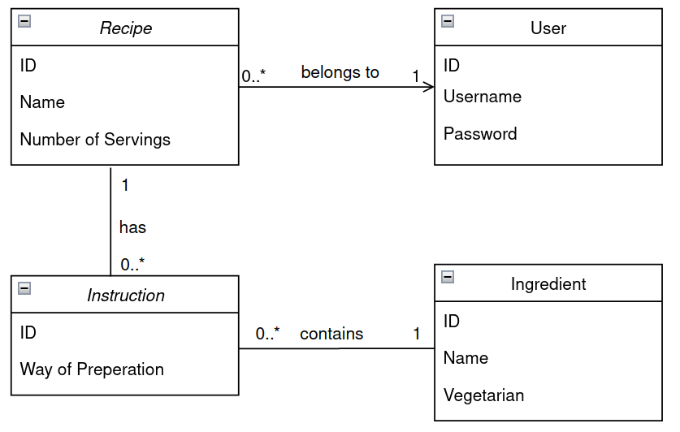

# Recipe Service

The Recipe Service is made for ABN Amro for the BE-Assessment

## Features
The service should allow to filter on the following:
| Criteria | Implemented |
| ------ | ------ |
| Whether or not the dish is vegetarian | Yes |
| The number of servings | Yes |
| Specific ingredients(either include or exclude) | Yes |
| Text search within the instructions | Yes |

## Installation
Install the maven dependencies

```sh
mvn clean install
```

After that you are able to run the application using the following command
```sh
mvn spring-boot:run
```

## Architectural decisions
The architecture of the service:


This way a recipe is easily modified, including the according instructions and ingredients. A recipe always belong to one user.

## Testing
The tests are created using Junit, AssertJ and SpringBoot Test. The unit- and integration tests can be found at the `/tests` folder.

## Used tools and frameworks
Multiple tools are used for developing the Recipe
- Spring Boot (Including the dependencies)
- Lombok
- Mapstruct
- Junit 5
- AssertJ
- H2
- HttpClient
- Maven
- Slf4J

## In order to be production ready
- The ID of the person is set in the Authorization header. In order to be production ready this ID has to be set through a JWT Bearer token. To do this, Spring Security should be integrated in the service, including a login endpoint.
- The quality of the code has to be checked, most likely by using a tool like Sonarqube. 
- Instead of the use of an InMemory database, a traditional database should be used.
- The application should be reviewed by others.
- Not all flows might be tested. Based on the result of Sonarqube, more tests could be added.
